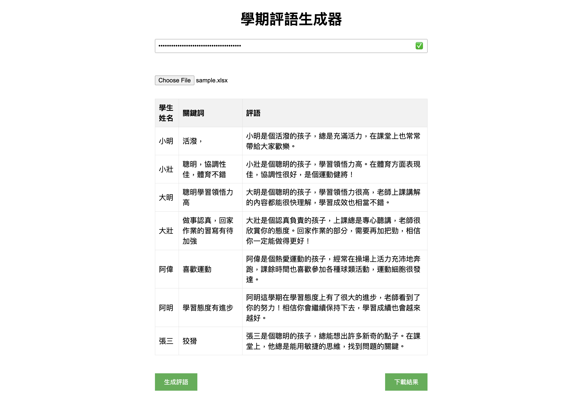
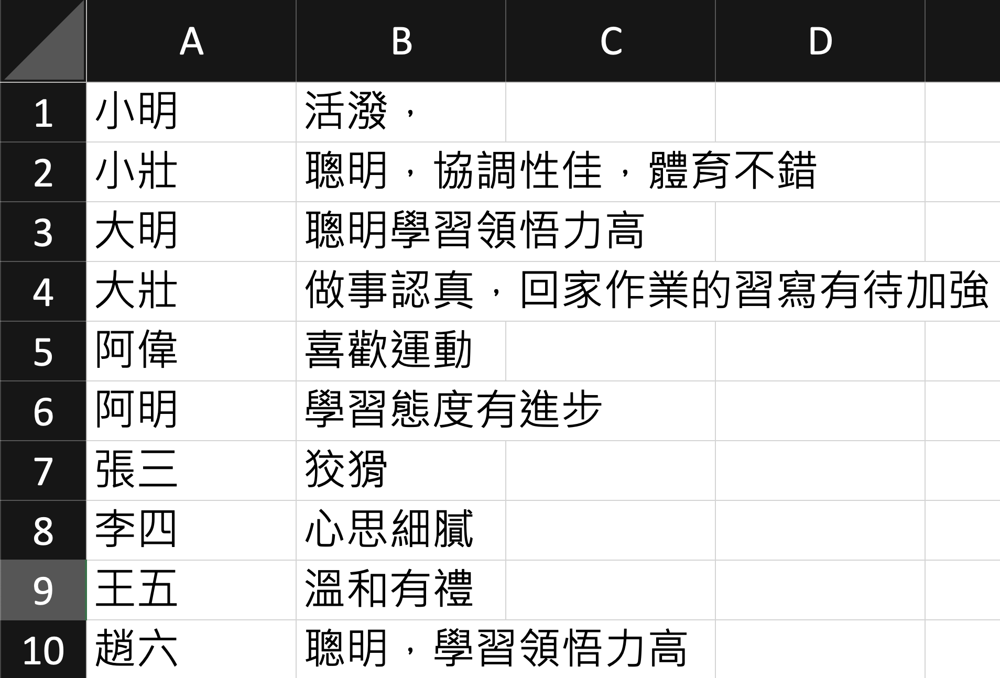
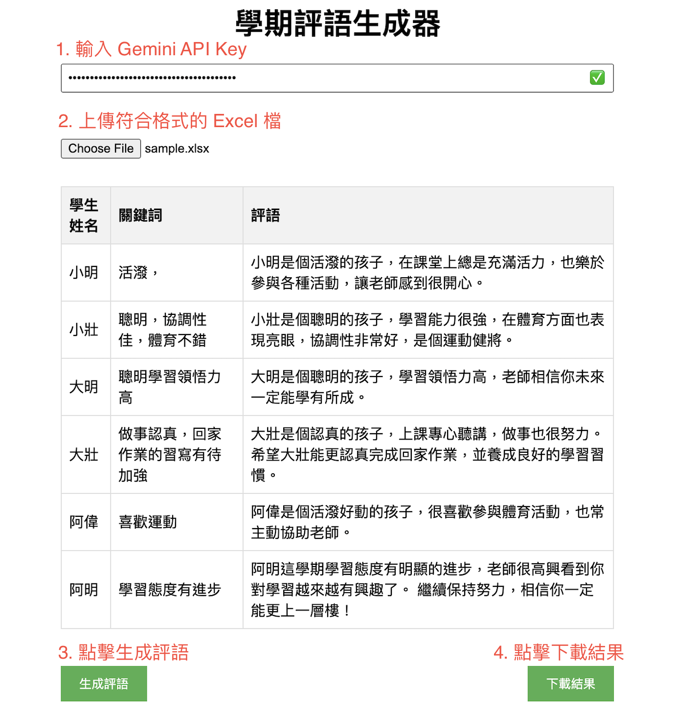

# AI Gen Semester Comments Tool

這是一個運用簡單幾個關鍵字自動生成期末評語的工具。

## Demo



## Python Version

- 創建一個 `config.py` 在 `python_version` 資料夾中，並在裡面寫入以下內容：

```python
GEMINI_API_KEY = 'YOUR_GEMINI_API_KEY'
```

- 安裝並進入虛擬環境(Poetry)：

```bash
poetry install
poetry shell
```

- 執行 `main.py`：

```bash
python main.py
```

## Website Version

可以直接在 [我架的網頁](https://ai-comments.moon-jam.me) 上使用這個工具，或是可以自己本地部署一個：

- cd 到 `website_version` 資料夾並安裝相關套件

```bash
cd website_version
npm install
```

- 執行網頁

```bash
npm run dev
```

- 到 [http://localhost:3000](http://localhost:3000) 開始使用

### 使用教學

- 先到 [Google AI Studio](https://aistudio.google.com/app/apikey) 建立 API Key (如下圖)，接著將 API Key 複製然後貼到 [網頁](https://ai-comments.moon-jam.me) 的框框中，並確認出現 ✅ 圖示，代表 API Key 設定成功
 建立 API Key - 1](assets/step-1.png)
 建立 API Key - 2](assets/step-2.png)
 建立 API Key - 3](assets/step-3.png)
 建立 API Key - 4](assets/step-4.png)
的框框中](assets/step-5.png)
- 創建一個 Excel 檔，在 A 欄輸入學生的名字， B 輸入學生的幾個特質，類似如下的格式，可以參考 [`sample.xlsx`](sample.xlsx)

- 接著點擊網頁中的`選擇檔案` (`choose file`) 按鈕，選擇剛剛創建的 Excel 檔，然後點擊下方的`生成評語`按鈕，就會開始生成評語了，生成完後點擊`下載結果`，就完成了！

