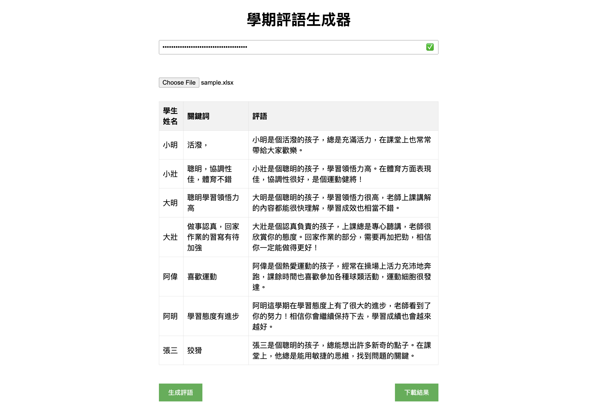

# AI Gen Semester Comments Tool

這是一個運用簡單幾個關鍵字自動生成期末評語的工具。

## Demo



## Python Version

- 創建一個 `config.py` 在 `python_version` 資料夾中，並在裡面寫入以下內容：

```python
GEMINI_API_KEY = 'YOUR_GEMINI_API_KEY'
```

- 安裝並進入虛擬環境(Poetry)：

```bash
poetry install
poetry shell
```

- 執行 `main.py`：

```bash
python main.py
```

## Website Version

可以直接在[我架的網頁](https://ai-comments.moon-jam.me)上使用這個工具，或是可以自己本地部署一個：

- cd 到 `website_version` 資料夾並安裝相關套件

```bash
cd website_version
npm install
```

- 執行網頁

```bash
npm run dev
```

- 到 [http://localhost:3000](http://localhost:3000) 開始使用
